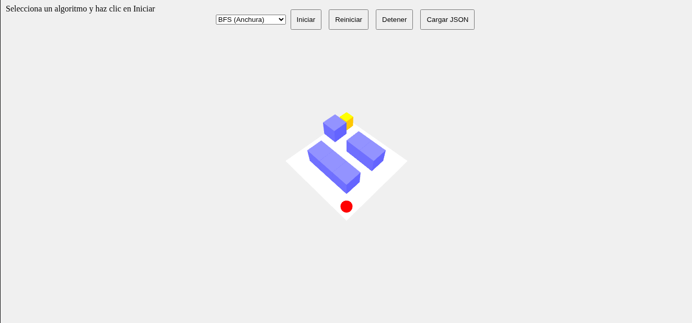
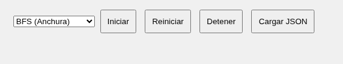
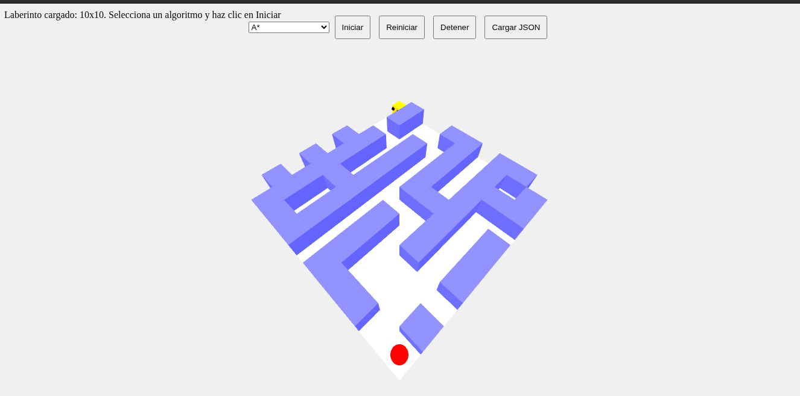
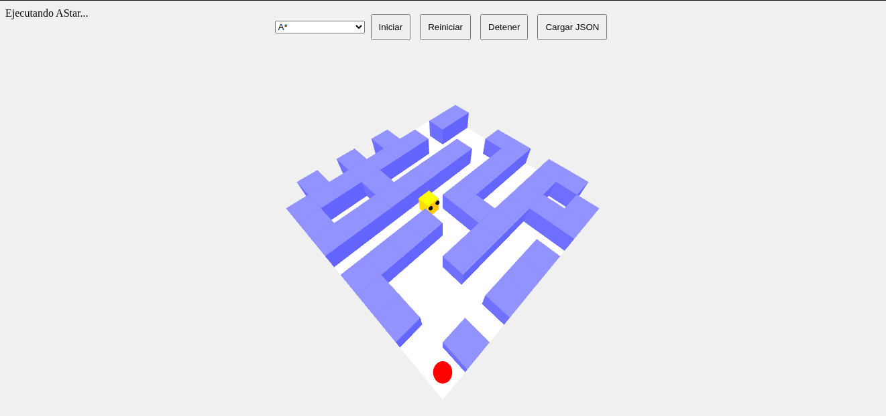
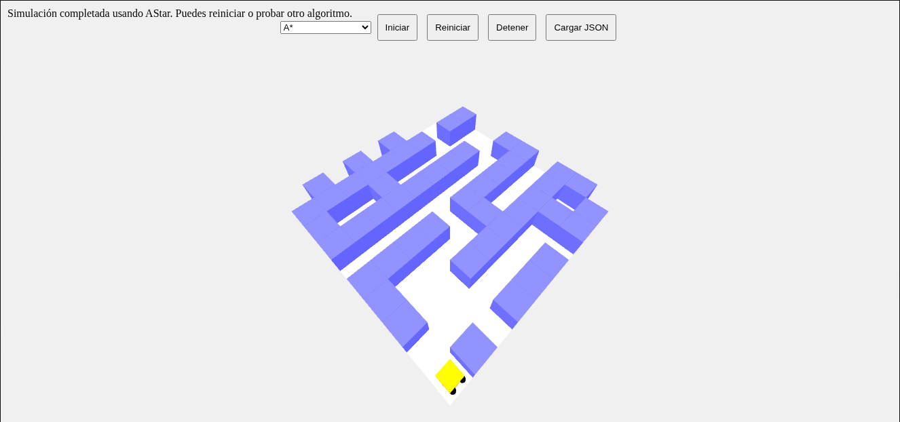

# **Manual Usuario - Sistema MazeBot**  

## **RESPONSABLES**

| _Nombre_                       | _Carnet_  |
| ------------------------------ | --------- |
| Nery Oswaldo Jiménez Contreras | 201700381 |
| Fredy Samuel Quijada Ceballos  | 202004812 |
| Elvis Joseph Vásquez Villatoro | 202006666 |

---

## **Requisitos del Sistema**  

- **Navegador web:** Chrome, Firefox, Edge u otros navegadores.  
- **Conexión a Internet:** Para funcionamiento de librerías.  
- **Archivos soportados:** `.json` para la carga de datos.  

---

## **Acceso al Sistema**  

1. **Abrir el navegador web**.  
2. **Cargar el archivo `index.html`** en el navegador.  
3. Utilizar cualquiera de las difrentes opciones presentadas en la interfaz.

---

## **Página Principal (`index.html`)**  

El sistema cuenta con una unica interfaz de usuario:

### **Opciones de Algoritmos**  

Se cuenta con diferentes opciones de algoritmos para la resolución del laberinto.
- BFS (Anchura)
- DFS (Profundidad)
- Dijkstra
- A*
- Costo Uniforme

### **Diferentes botones**  
El sistema cuenta con diferentes botones para la interacción del usuario:
- Iniciar. Nos permite iniciar el algoritmo seleccionado.
- Reiniciar. Nos permite reiniciar el laberinto.
- Detener. Nos permite detener el algoritmo seleccionado.
- Cargar Json. Nos permite cargar un archivo `.json` para la carga de datos y creación del laberinto.

### **Inicio de algoritmo**  
1. Ingresar el laberinto en formato `.json` utilizando el botón "Cargar Json".
2. Seleccionar el algoritmo deseado.
3. Hacer clic en el botón "Iniciar" para comenzar la resolución del laberinto.

### **Inicio del laberinto**

### **Proceso de resolución**

### **Finalización del laberinto**

---